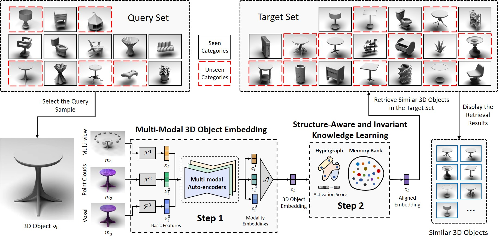

# Hypergraph-Based Multi-Modal Representation for Open-Set 3D Object Retrieval
This repository contains the source code for the paper "Hypergraph-Based Multi-Modal Representation for Open-Set 3D Object Retrieval" published in IEEE Transactions on Pattern Analysis and Machine Intelligence (TPAMI) 2024 by [Yifan Feng](https://fengyifan.site/), Shuyi Ji, Yu-Shen Liu, Shaoyi Du, Qionghai Dai, Yue Gao*. This paper is available at [here](https://ieeexplore.ieee.org/abstract/document/10319392/).



## Introduction
In this repository, we provide our implementation of Hypergraph-Based Multi-Modal Representation (HGM$^2$R), which is based on the following environments:
* [python 3.9](https://www.python.org/): basic programming language.
* [torch 1.12.1](https://pytorch.org/): for computation.
* [hydra-core 1.3.2](https://hydra.cc/docs/intro/): for configuration and multi-run management.

## Installation
1. Clone this repository.
2. Install the required libraries.
``` bash
pip install -r requirements.txt
```

## Downloads
In this paper, we release four datasets (OS-ESB-core, OS-NTU-core, OS-MN40-core, and OS-ABO-core) for Open-Set Retrieval task, which can be download in [here](https://moon-lab.tech/os3dor). Our dataset splitting files of the four datasets can be download in [here](https://pan.baidu.com/s/1uvrT9xBps6DENndxyu8V_A?pwd=evby). And those pre-extracted features (80 files) of the four datasets can be download in [here](https://pan.baidu.com/s/1gylhaVO9dXmTbfIqV3DMBw?pwd=y774). The pre-extracted features should be placed in the `feature` folder.

## Usage
First, you should compress the voxel features with the following command:
```bash
python pre_vox_ft_compress.py
```
Then, you can train the HGM$^2$R model with the following command:
```bash
python train_hgm2r.py
```
To change the dataset, you can modify the `line 272` of `train_hgm2r.py` with names (esb, ntu, mn40, abo):
```python
dataset = "esb" # esb, ntu, mn40, abo
```

## Citation
If you find this repository useful in your research, please cite our following papers:
```
@article{feng2023hypergraph,
  title={Hypergraph-Based Multi-Modal Representation for Open-Set 3D Object Retrieval},
  author={Feng, Yifan and Ji, Shuyi and Liu, Yu-Shen and Du, Shaoyi and Dai, Qionghai and Gao, Yue},
  journal={IEEE Transactions on Pattern Analysis and Machine Intelligence},
  year={2023},
  publisher={IEEE}
}

@inproceedings{feng2019hypergraph,
  title={Hypergraph neural networks},
  author={Feng, Yifan and You, Haoxuan and Zhang, Zizhao and Ji, Rongrong and Gao, Yue},
  booktitle={Proceedings of the AAAI conference on artificial intelligence},
  volume={33},
  number={01},
  pages={3558--3565},
  year={2019}
}
```
